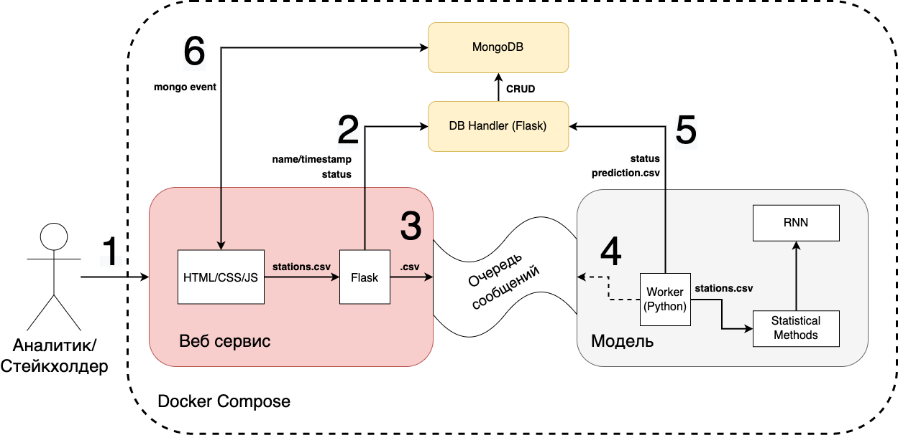

# Авиахакатон. Решение команды Collapse на трек МТС

В данном репозитории находится решение команды Collabse. Никакие наработки до хакатона не использовались, продукт был создан только за время хакатона

## Содержание

- [Авиахакатон. Решение команды Collapse на трек МТС](#авиахакатон-решение-команды-collapse-на-трек-мтс)
  - [Содержание](#содержание)
  - [Описание решения](#описание-решения)
  - [Инструкция по запуску](#инструкция-по-запуску)
  - [Структура репозитория](#структура-репозитория)
    - [readme-assets](#readme-assets)
  - [Архитектура](#архитектура)
  - [Описание модели машинного обучения](#описание-модели-машинного-обучения)
  - [Результаты тестов модели](#результаты-тестов-модели)
  - [Контакты](#контакты)

## Описание решения

## Инструкция по запуску

## Структура репозитория

### readme-assets

Тут хранятся исходники всех файлов проекта

## Архитектура

## Описание модели машинного обучения

Мы рассматриваем данные о расходных операциях и отгрузках со склада, оттуда берем общую отгрузку с конкретного склада за месяц. Далее смотрим плановое кол-во постройки Базовых станция за этот месяц. И таким образом получаем для каждого склада для каждого месяца среднее значение обьема для одной базовой станции. Далее усредняем и получаем среднее значение объёма одну базовую станцию для каждого склада. (Тут я только что идею придумал, так что со стороны посмотри). Далее пользователь вводит файл с планом постройки базовых станций. Мы берем и смотрим в какие дни недели на склад активнее доставляли, в какие отправляли, и далее распределяем эту общую отгрузку/загрузку по складу соответственно проценту средней отгрузки/загрузки по дням, ну и раньше даты постройки объекта конечно же

## Результаты тестов модели

## Контакты
